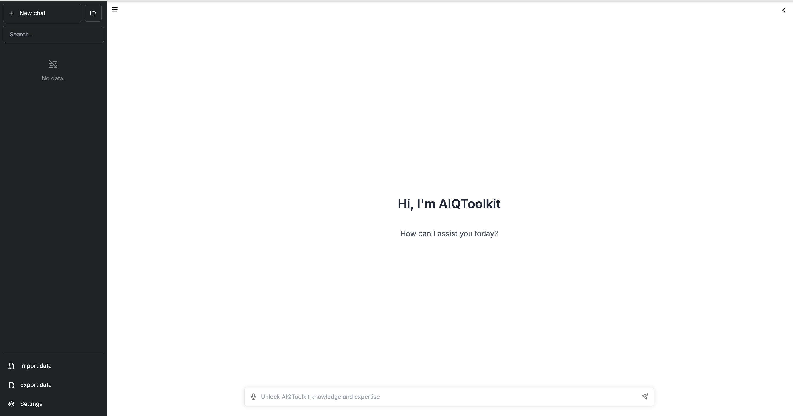
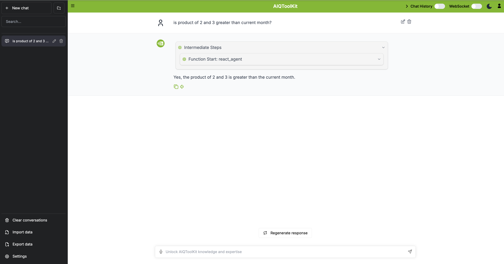

# NeMo Agent Toolkit - UI

[](LICENSE)
[](https://github.com/NVIDIA/NeMo-Agent-Toolkit)

This is the official frontend user interface component for [NeMo Agent Toolkit](https://github.com/NVIDIA/NeMo-Agent-Toolkit), an open-source library for building AI agents and workflows.

This project builds upon the work of:

- [chatbot-ui](https://github.com/mckaywrigley/chatbot-ui) by Mckay Wrigley
- [chatbot-ollama](https://github.com/ivanfioravanti/chatbot-ollama) by Ivan Fioravanti

## Features

- 🎨 Modern and responsive user interface
- 🔄 Real-time streaming responses
- 🤝 Human-in-the-loop workflow support
- 🌙 Light/Dark theme
- 🔌 WebSocket and HTTP API integration
- 🐳 Docker support

## Getting Started

### Prerequisites

- [NeMo Agent Toolkit](https://github.com/NVIDIA/NeMo-Agent-Toolkit) installed and configured
- Git
- Node.js (v18 or higher)
- npm or Docker

### Installation

Clone the repository:

```bash
git clone git@github.com:NVIDIA/NeMo-Agent-Toolkit-UI.git
cd NeMo-Agent-Toolkit-UI
```

Install dependencies:

```bash
npm ci
```

### Running the Application

#### Local Development

```bash
npm run dev
```

The application will be available at `http://localhost:3000`

#### Docker Deployment

```bash
# Build the Docker image
docker build -t nemo-agent-toolkit-ui .

# Run the container with environment variables from .env
# Ensure the .env file is present before running this command.
# Skip --env-file .env if no overrides are needed.
docker run --env-file .env -p 3000:3000 nemo-agent-toolkit-ui
```



## Configuration

### Environment Variables

The application supports configuration via environment variables in a `.env` file:

**Application Configuration:**
- `NEXT_PUBLIC_NAT_WORKFLOW` - Application workflow name displayed in the UI
- `NEXT_PUBLIC_NAT_BACKEND_ADDRESS` - **Required** - Backend server address without protocol (e.g., '127.0.0.1:8000' or 'api.example.com')
  - Used for both HTTP API and WebSocket connections
  - Protocols are automatically added: `http`/`ws` in development, `https`/`wss` in production

**MCP Configuration:**
- `NEXT_PUBLIC_MCP_PATH` - MCP client API path (defaults to `/mcp/client/tool/list`)
  - **Note**: Uses the same server as `NEXT_PUBLIC_SERVER_URL`.
**Feature Toggles:**
- `NEXT_PUBLIC_NAT_WEB_SOCKET_DEFAULT_ON` - Enable WebSocket mode by default (true/false)
- `NEXT_PUBLIC_NAT_CHAT_HISTORY_DEFAULT_ON` - Enable chat history persistence by default (true/false)
- `NEXT_PUBLIC_NAT_RIGHT_MENU_OPEN` - Show right menu panel by default (true/false)
- `NEXT_PUBLIC_NAT_ENABLE_INTERMEDIATE_STEPS` - Show AI reasoning steps by default (true/false)


**Optional Configuration:**
- `NAT_BACKEND_URL` - **Advanced** - Override HTTP API backend URL for production (e.g., 'http://nat-backend-internal:8000')
  - Only set this if your internal API routing differs from the public WebSocket address
  - If not set, automatically derived from `NEXT_PUBLIC_NAT_BACKEND_ADDRESS`
  - Example use case: Internal Docker network for API, public domain for WebSocket
- `NAT_DEFAULT_MODEL` - Default AI model identifier for server-side rendering
- `NAT_MAX_FILE_SIZE_STRING` - Maximum file upload size for all operations (e.g., '5mb', '10mb', '1gb')
- `NODE_ENV` - Environment mode (development/production) affects security settings
- `NEXT_TELEMETRY_DISABLED` - Disable Next.js telemetry data collection (1 to disable)

### HTTP API Connection

Settings can be configured by selecting the `Settings` icon located on the bottom left corner of the home page.


### Settings Options

**Appearance:**
- `Theme`: Switch between Light and Dark mode

**API Configuration:**
- `HTTP Endpoint`: Select API endpoint type:
  - **Chat Completions — Streaming** - Real-time OpenAI Chat Completions compatible API endpoint with streaming responses
  - **Chat Completions — Non-Streaming** - Standard OpenAI Chat Completions compatible API endpoint
  - **Generate — Streaming** - Text generation with streaming
  - **Generate — Non-Streaming** - Standard text generation
- `Optional Generation Parameters`: OpenAI Chat Completions compatible JSON parameters that can be added to the request body (available for chat endpoints)

**WebSocket Configuration:** The WebSocket path defaults to `websocket`.
- `WebSocket Schema`: Select schema for real-time connections:
  - **Chat Completions — Streaming** - Streaming chat over WebSocket
  - **Chat Completions — Non-Streaming** - Non-streaming chat over WebSocket
  - **Generate — Streaming** - Streaming generation over WebSocket
  - **Generate — Non-Streaming** - Non-streaming generation over WebSocket

**Note:** For intermediate results streaming, use **Chat Completions — Streaming** (`/chat/stream`) or **Generate — Streaming** (`/generate/stream`).

## Usage Examples

### Getting Started Example

#### Setup and Configuration

1. Set up [NeMo Agent Toolkit](https://docs.nvidia.com/nemo/agent-toolkit/latest/quick-start/installing.html) following the getting started guide
2. Start workflow by following the [Getting Started Examples](https://github.com/NVIDIA/NeMo-Agent-Toolkit/blob/develop/examples/getting_started/simple_calculator/README.md)

```bash
nat serve --config_file=examples/getting_started/simple_calculator/configs/config.yml
```

#### Testing the Calculator

Interact with the chat interface by prompting the agent with the message:

```
Is 4 + 4 greater than the current hour of the day?
```



### Human In The Loop (HITL) Example

#### Setup and Configuration

1. Set up [NeMo Agent Toolkit](https://docs.nvidia.com/nemo/agent-toolkit/latest/quick-start/installing.html) following the getting started guide
2. Start workflow by following the [HITL Example](https://github.com/NVIDIA/NeMo-Agent-Toolkit/blob/develop/examples/HITL/simple_calculator_hitl/README.md)

```bash
nat serve --config_file=examples/HITL/simple_calculator_hitl/configs/config-hitl.yml
```

#### Configuring HITL Settings

Enable WebSocket mode in the settings panel for bidirectional real-time communication between the client and server.


#### Example Conversation

1. Send the following prompt:

```
Can you process my input and display the result for the given prompt: How are you today?
```

2. Enter your response when prompted:


3. Monitor the result:


### Server Communication

The UI supports both HTTP requests (OpenAI Chat compatible) and WebSocket connections for server communication. For detailed information about WebSocket messaging integration, please refer to the [WebSocket Documentation](https://docs.nvidia.com/nemo/agent-toolkit/latest/reference/websockets.html) in the NeMo Agent Toolkit documentation.

## License

This project is licensed under the MIT License - see the [LICENSE](LICENSE) file for details. The project includes code from [chatbot-ui](https://github.com/mckaywrigley/chatbot-ui) and [chatbot-ollama](https://github.com/ivanfioravanti/chatbot-ollama), which are also MIT licensed.
